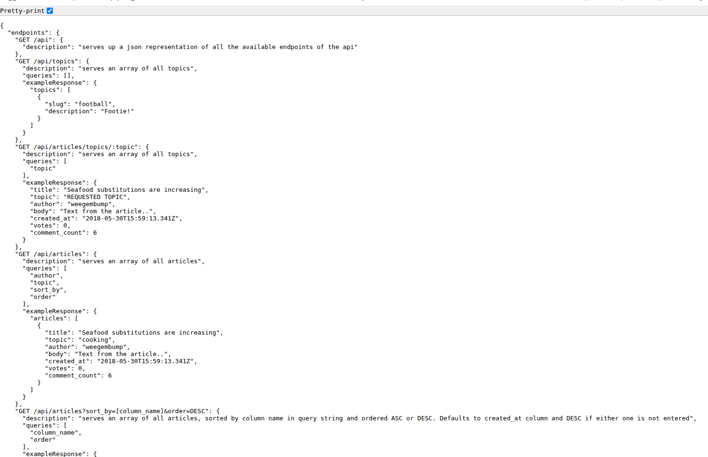
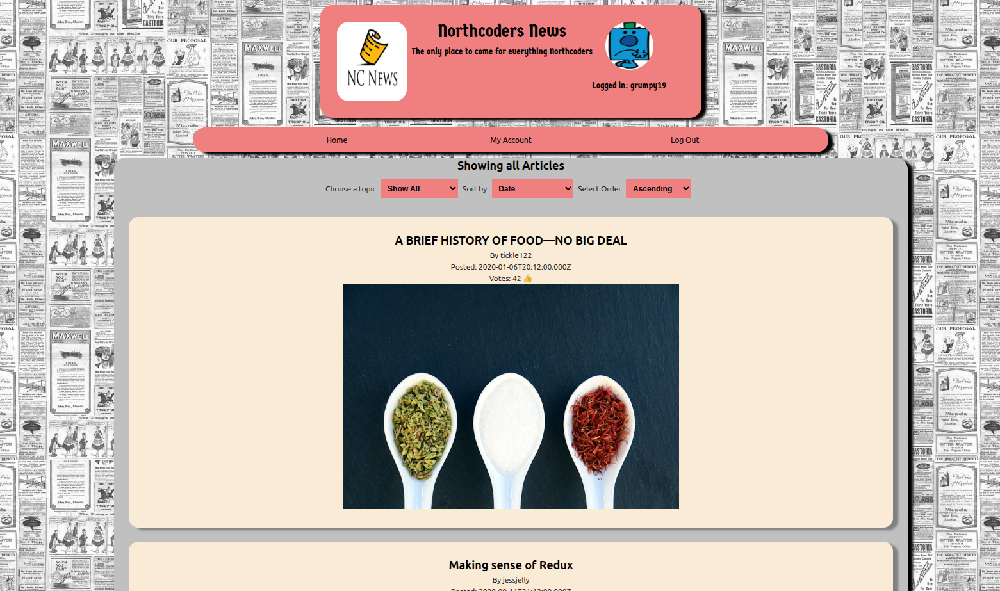

<div>
  <h2>👋 Hi there! Paul here.</h2>  
  <br>
  <h2>TestMango-sudo (Don't Ask 😄)</h2>
  <br>
  <div>
    
    <p size="20"><strong>TestMango-sudo</strong></p>
    <br><br>
  </div>
  <p align="left">
    I'm an aspiring Developer and having just completed a software development course with Northcoders, I'm looking to land my first job as a software developer.
    I am familiar with Javascript, Python and have designed projects front and back end projects using react, flask and both relational and non-relational databases.  
  </p>
</div>

```JavaScript
        export function aspiringDeveloper()  { 
        Location: North-West England; 
        height: 187cm; 
        type: male; 
        currentlyWorkingOn: Stack-Dew-Valley Project.🔭 ;
        techStack: ['JavaScript', 'Python', 'CSS', 'HTML', 'SQL'];
        Tools: ['React', 'VUE', 'Jinja', 'Flask'];
        😄Pronouns: He/him;
        📫How to reach me: 'testmango1965@yahoo.com;
        ⚡Fun fact1: 'Previously working in Mechanical / Electrical Engineering and I.T support gives me a unique take on problem solving'
        ⚡Fun fact1: I'm conversely a bit of a night owl, but also an early bird. 🤷
        currentlyLearning: [TypeScript, Phaser]
}
```  

<h2>Currently Working On:</h2>
<div >
  <div >
    
  </div>
  <div>
  <p>
    Currently I'm completing a final project from my time at Northcoders, called StackDew Valley.<br>
    You can find out more here:  <a href="https://www.northcoders.com/blog/student-projects-stack-dew-valley/">StackDew Blog</a> <br>
    The site for this project is hosted live here: <a href="https://stackdewvalley-686c6.web.app/">Stack Dew Valley</a>
  </p>  
  </div>
</div>
<br>

# Other Projects
<div>
  <h2>NorthCoders News</h2>
   <div >
    
  </div>
  <p align="right">An example of a news site with articles that users can read and interact with. <br>
      The back end for this site is hosted on render with which you can make api calls <br>
      to a <strong>'news database'</strong> located on Supabase. <br>
      The live hosted link for this is here: <a href="https://nc-news-backend-boh2.onrender.com/api">NCNEWS API</a>. <br>
  </p>
   <div>
    
  </div>
     <div>
    <p align="left">The front end UI for this site is hosted on Netlify and allows users to select <br>
      an article topic and like or comment on an article. Login for the site is only simulated at the <br>
      moment, but I will look to add authentication at a later date.
      You can see the live website on Netlify here:<br>
      <a href="https://6819cbc3a2234b9f905c4f26--newsatnorthcoders.netlify.app/">NC NEWS Frontend</a>
    </p>
    </div>
</div>


